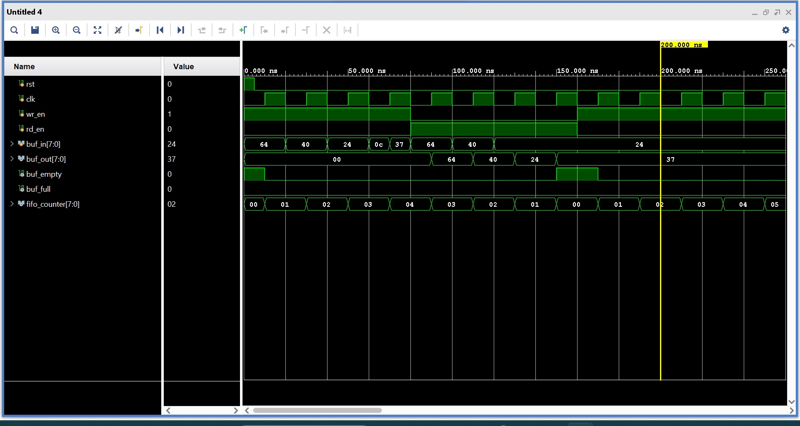

A Single clock FIFO is being designed using verilog and simulated on AMD Vivado tool.
# FIFO
A FIFO is commonly know as buffer and gets the name from the scheme ofFirst In First Out, which typically means that as the data is written serially into the buffer, the data which is written first will be read out from the buffer first.

The final wave form obtained is:
